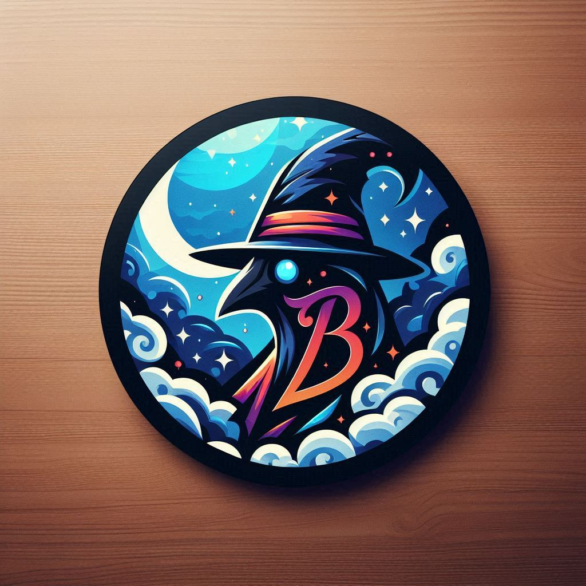

# NUOS-MagickMin-7B-Instruct

OpenSource 7 Billion Large Language Model

NUOS-MagickMin-7B-Instruct is a large language model with 7 Billions Parameters.

It is mainly focus on working effectively at 4 Bit Stage of LLM, for cheaper, faster runtime inferencing.

## Info

- Model Weight - [https://huggingface.co/MagickoSpace/NUOS-MagickMin-7B-Instruct](https://huggingface.co/MagickoSpace/NUOS-MagickMin-7B-Instruct)
- License - MIT
- Backbone Model - [jojo-ai-mst/rolema-7b-it](https://huggingface.co/jojo-ai-mst/rolema-7b-it)

## Contributors

- Mark Ranford
- Min Si Thu
